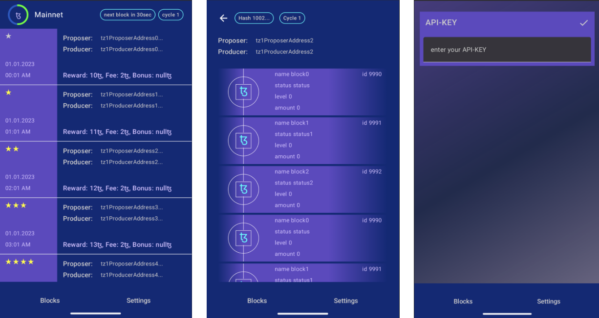

    
<h1>Tezos Viewer</h1>

This is a project that allows you to view the state of the Tezos blockchain.

Data provided by [TzKT API](https://api.tzkt.io).

## Overview

The architecture is follows a agile and domain driven approach. 

Please see [Architecture Vision](documentation/202503_Tezos_Viewer_Architecture_Vision.pdf)

    

Current Tech-Stack:
1. Jetpack Compose
2. NavHost
3. Ktor - api client
4. ModernStorage - google`s fileSystem storage
5. Mockk - Test Framework for mocking data

### Domains

The is divided into different domains. Each domain represents a stakeholder epic.

#### Blocks
Overview of the current state of the Tezos Blockchain. The latest blocks for the current cycle
are displayed.

#### Block
Details of a selected Block within the Blockchain.

#### Settings
Access user settings like adding Api-Key for PRO access to the Tezos blockchain.

### Testing
- [turbine](https://github.com/cashapp/turbine) for coroutines as unit-test
- [mockk](https://github.com/mockk/mockk) for mocking entities